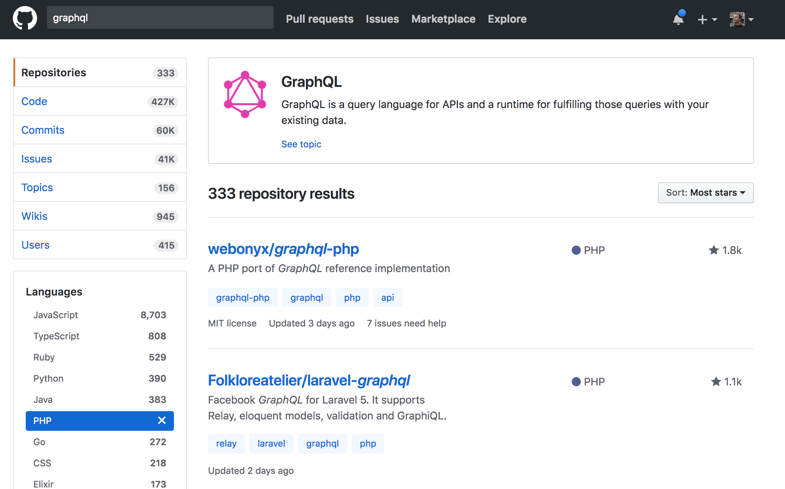
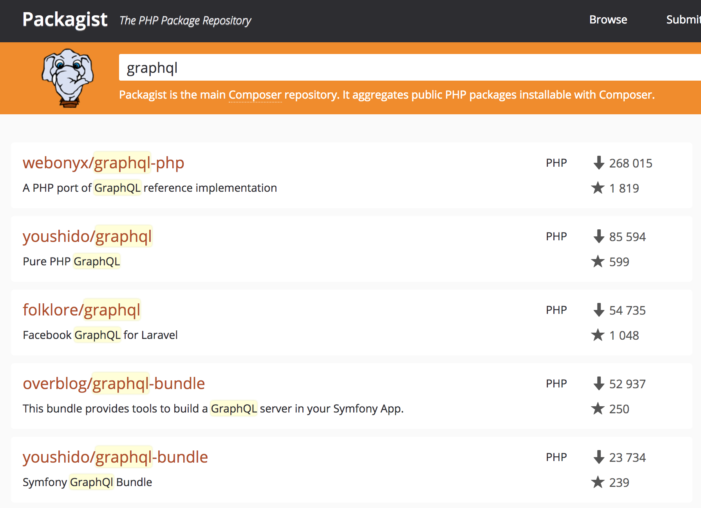
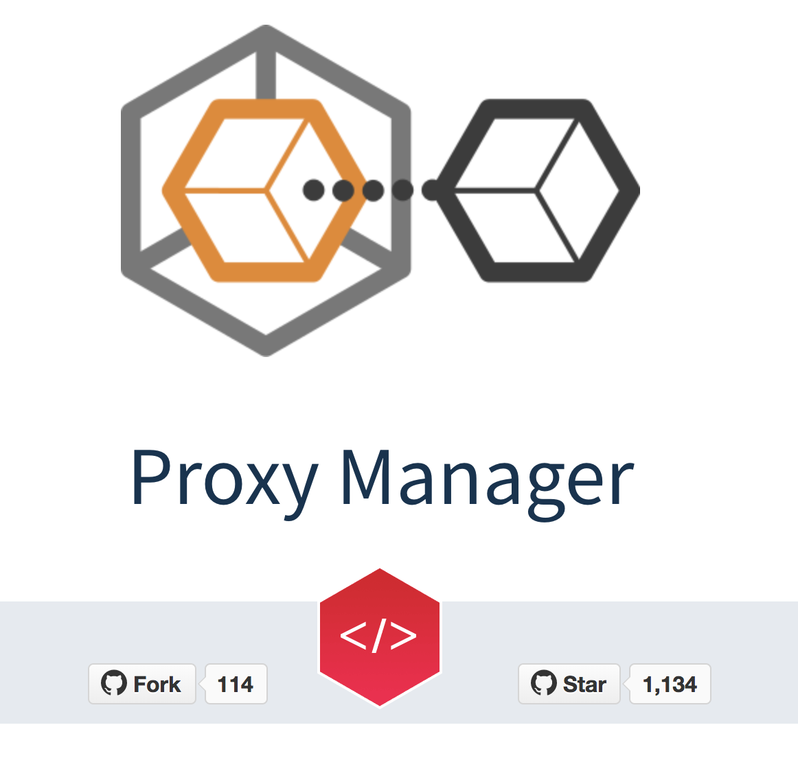
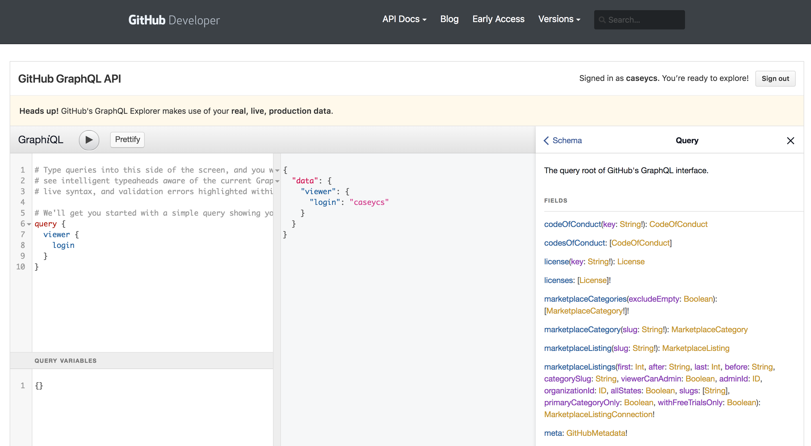

# Adding GraphQL to an existing project 

Ilia Kondrashov

---

## During next 15 minutes...

Or maybe a bit more ;-)

* About GraphQL: into, examples, use-cases
* Defining protocol
* Implementation: libraries, frameworks integration
* Writing the code: resolvers, middleware
* Error handling: format, types, logging
* Testing, security, tooling
* Lead time: how long it will take
* Questions

---

## Few words about myself

Ilia Kondrashov

I’m doing web development since ~2003

Development, infrastructure, product

---

## About GraphQL

* New REST
* Strictly typed
* Self-documented (including comments and deprecation marks)

+++

### Examples

```
schema {
  query: Query
}
type Query {
  pet: Pet
}
type Pet {
  name: String
}
```

+++

### Comments and deprecations

```
type Query {
  petty: Petty! @deprecated(reason: "Please use petNew instead")
  # Free text comment!
  pet: Pet!
}
```

+++

### Scalar types, required flag and composition 

```
type Pet {
  name: String!
  count: Integer
  isActive: Boolean!
  sibling: Pet
  children: [Pet]!
}
```

+++

### Enums

No more pain to understand all possible values:

```
type Schedule {
  weekdays: Weekday!
  ...
}
enum Weekday {
  FRIDAY
  MONDAY
  ...
}
```

+++

### Custom scalar types

Allows "on-the-fly" data conversion: both incoming, and resulting.

Examples: 

* Date
* DateTime
* Uuid

So your resolvers can operate with Carbon and UuidInterface.

+++

### Use-cases

* External API
* Front-end, especially - fully separated ones, since Twig and whole back-end templating is slowly dying
* Back-office - however it does not feel like from the first look

+++

### Who are using GraphQL?

* Facebook
* GitHub 
* Coursera
* Yelp
* ...

---

## Defining protocol

Separating entities - different point of view, then database tables and Doctrine models.

User from the front-end prospective might mean combination of all your database tables, which store all the related data.

Hard to get "back-end developer" context out of your head and start thinking as an API consumer.

+++

### Entities

Think about domain entities, but not your database!

Examples of different approach:

* ImageAvatar with specific resizes instead of generic Image Model
* Geolocation of different elements from the front-end prospective might look all the same, even when on the back-end they are stored totally different

+++

### Queries

```
schema {
  query: Query
}
type Query {
  user(uuid: Uuid!): User!
}
type User {
  post(filter: PostFilter!): Post!
}
input PostFilter {
  uuid: Uuid
  slug: String
}
type Post {
  uuid: Uuid
}
```

+++

### Mutations

```
authLoginViaEmail(input: AuthLoginViaEmailInput)
  : AuthLoginViaEmailPayload

input AuthLoginViaEmailInput {
  email: String!, password: String!
  location: LocationInput
}

input LocationInput {
  lat: Float!, lng: Float!}

type AuthLoginViaEmailPayload {
  viewer: Viewer!}

type Viewer {
  uuid: Uuid!}
```

---

## Libraries

What open-source community will bring to us

+++ 

### Github



+++

### Packagist



+++

### Eloquent binding

... and similar ORM/ActiveRecord mappers - please, don't.

---

### Serving requests

* Bullt-in PSR-7 compatible server
* Facade method

+++

#### PSR-7 Server

Provides standalone server, which you can plug into your framework (Laravel, Symfony, Slim, Zend Expressive)

Laravel example:

```
use Psr\Http\Message\ServerRequestInterface;
Route::get('/', function (ServerRequestInterface $request) {
    return app(GraphQL\Server\StandardServer::class)
      ->executePsrRequest($request)
});
```

* Looks simple
* Works out of the box

+++

#### Facade method

Which you can inside regular controller action method:

```
$resultArray = \GraphQL\GraphQL::executeQuery(
    $schema, $queryString, $rootValue, $context, $variables
);
```

* Simpler to debug & fine-tune
* Allows more customisation
* Can be integrated with whatever framework 

---

## Describing protocol

+++

### Via PHP code

Arrays and classes

+ you get all the functionality (unions, returning interfaces, etc)

- looks horrible ;-)

- extra tooling to expose for the front-end team: deploy-on push, auto-generate on commit, etc

- no way for the front-end developers to make/comment on pull requests

+++ 

### Via schema file

+ simpler&easier to setup and collaborate

- does not support all the GraphQL features

---

## Writing resolvers

What is are `resolvers`?

Very confusive example out-of-the-box!

```
$queryType = new ObjectType([
    'name' => 'Query',
    'fields' => [
        'echo' => [
            'type' => Type::string(),
            'args' => [
                'message' => Type::nonNull(Type::string()),
            ],
            'resolve' => function ($root, $args) {
                return $root['prefix'] . $args['message'];
            }
        ],
    ],
]);
```

+++

### How do we deal with it

Closure hell. It really is.

```
interface ResolverInterface
{
    public function resolve($root, $args, Context $context);
}
```

`$root` is an array of root-level resolvers
`$context` is a container (usually immutable) to pass global scope, such as authorisation details.

* Class per each query and mutation
* ArrayResolver per type for scalar fields
* ClosureResolver per type for relations

+++

### Array resolvers

* Input: models/entities of your application
* Output: array with scalars and closures

Closures are very important part! You can always return a closure instead of a raw field, and it will be executed only on demand. 

```
type User {
  uuid: Uuid!
  email: String!
  avatar: ImageAvatar
  posts(filter: PostsFilter!): [Post]!
  address: Address!
}
```

+++

### Closure resolvers

Types have relations (user->post, post->comments, comment->parentComment), so we use classes which return closures to deal with it:

```
class ClosureResolver\ImageAvatar {
  public function byUserUuid(UuidInterface $uuid) {
    return array $root, array $args, Context $context) use ($userUuid) {
      ...
      return $this->imageAvatarArrayResolver($model)
    }
  }
}
```

+++

### N+1 issues

There is a good way to use mysql `where IN` or Redis `mget`, it's just one more closure ;)

+++

### Circular dependencies

In order to instantiate resolvers regular DI will fail

```
type User {
  lastPost: Post!
}
type Post {
  user: User!
}
```

```
ArrayResolver\User
-> ClosureResolver\Post
-> ArrayResolver\Post
-> ArrayResolver\User
```

+++

### ProxyManager

OOP Proxy wrappers utilities - generates and manages proxies of your objects.



https://github.com/Ocramius/ProxyManager

+++

### Fields&relations visibility/restrictions

We have guests, users and admins.

It's very convenient to use GraphQL for all of them: simple, no code duplication.
However extra attention which field to show to whom is important. 

+++

Two approaches: fake/downgrade or throw an error (like `permissionDenied`).

* Mark fields as required according to the real data model, and return empty value (empty string, -1, beginning of the century for the date) on user permissions mismatch
* Always "downgrade" related data queries according to user permissions
* Return `permissionDenied` application error only for definitely invalid use-cases, like filter enum value which is available only for owners.

+++

### Writing middleware

No middleware support our of the box, but you can emulate them by wrapping resolvers into closures.

Example use-case: analyse resolver interface to extract permissions check:

```
interface AuthorizedResolverInterface
interface AdminResolverInterface
```
---

## Error handling

* What do we return to the client
* Types of errors
* Logging

+++

### Default error format

```
mutation internalError {
  internalError
}
{
  "errors": [
    {
      "message": "Internal server error",
      "category": "internal",
      "locations": [
        {
          "line": 2,
          "column": 3
        }
      ],
      "path": [
        "internalError"
      ]
    }
  ],
  "data": {
    "internalError": null
  }
}
```

+++

### Handling multiple errors (validation)

* Multiple errors per request
* Nested errors via custom formatter

```
{
  "errors": [
    {
      "message": "Demo error",
      "category": "application",
      "locations": [
        {
          "line": 2,
          "column": 3
        }
      ],
      "path": [
        "applicationError"
      ],
      "error": "demoError",
      "field": "field",
      "params": {
        "param": "value"
      },
      "children": [
        {
          "error": "error",
          "message": "Error message",
          "field": "field",
          "params": {
            "param": "value"
          }
        }
      ]
    }
  ],
  "data": {
    "applicationError": null
  }
}
```

+++

### Types of errors

Out-of-the-box: `interface GraphQL\Error\ClientAware` - to propagate original exception to the GraphQL errors (message). Don't do it.

* Category `application/internal` - do separate something that front-end should handle
* `error` field as identifier for the front-end

```
{
  "message": "Something human-readable",
  "category": "application",
  "error": "camelCaseIdentifier"
}
```

+++

### Logging

We do handle all the exceptions, yes. However it's important not to forger to still log them - at least 

---

## Testing

You will have to write custom PHPUnit abstraction layer. For example:

```
assertQuerySuccess(Query $query, array $variables = []
  ): GraphQLResponse
assertQueryFail(Query $query, array $variables = []
  ): GraphQLResponse
assertQueryErrors(string ...$expectErrors): void
```

+++

### PHPUnit helper calls

* Handy to have helper methods for every request
* Use faker to generate variables as much as possible, but allowing to overwrite them via `$variables`
* Allow to customise return fields for reusability


```
queryXxxx(
  array $variables,
  string $returnFields = '{default{fields}}'
): Query
mutationYyyy(
  array $variables,
  string $returnFields = '{default{fields}}'
): Query
```

+++

### Test example

```
public function testRegistrationSuccess()
{
  $mutation = $this->mutationAuthRegister(
    [],
    '{viewer{user{firstName}}}'
  );
  $this->assertQuerySuccess($mutation);
  $this->assertSame(
    $mutation->vars->firstName,
    $this->responseData['viewer.user.firstName']
  );
}
```

---

## Security

* Disable introspection on production
* Use CSRF token
* Limit maximal queries complexity
* Hide your back-office JS from public access

---

## Tooling

### Schema browser

[ChomeiQL](https://chrome.google.com/webstore/detail/chromeiql/fkkiamalmpiidkljmicmjfbieiclmeij?hl=en)



+++

### Allows you to add new call

[GraphQL Faker](https://github.com/APIs-guru/graphql-faker)


Proxies your current endpoint and allows you to add new queries and fields to existing ones.

--- 

## Lead time

* Learning curve: 1 week for playground and experiments
* First prototype: 1 week for basic integration
* First real use-case: 2 weeks before going live, including alignment with the front-end team

+++ 

### It's not super-simple

This is what you will feel during first 1-2 weeks, while trying to combine all the pieces together.

---

## Questions

Feel free to ask!

This presentation is available on GitHub

https://github.com/caseycs/amsterdam-php-opening-graphql